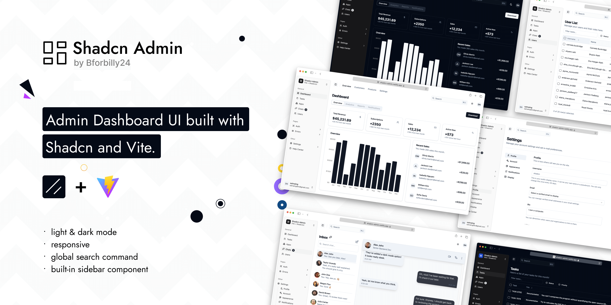

# Travio-React-Frontend

Travio adalah sebuah sistem yang dirancang untuk mendeteksi pelanggaran secara otomatis dengan memanfaatkan YOLOv5 untuk deteksi objek dan DeepSORT untuk pelacakan.

## Basis dan Inspirasi

Tampilan antarmuka (UI) dan struktur dasar proyek ini diadaptasi dari template [Shadcn Admin Dashboard](https://github.com/satnaing/shadcn-admin) yang dibuat oleh [@satnaing](https://github.com/satnaing).

## Shadcn Admin Dashboard

Admin Dashboard UI crafted with Shadcn and Vite. Built with responsiveness and accessibility in mind.



I've been creating dashboard UIs at work and for my personal projects. I always wanted to make a reusable collection of dashboard UI for future projects; and here it is now. While I've created a few custom components, some of the code is directly adapted from ShadcnUI examples.

> This is not a starter project (template) though. I'll probably make one in the future.

## Features

- Light/dark mode
- Responsive
- Accessible
- With built-in Sidebar component
- Global Search Command
- 10+ pages
- Extra custom components

## Tech Stack

**UI:** [ShadcnUI](https://ui.shadcn.com) (TailwindCSS + RadixUI)

**Build Tool:** [Vite](https://vitejs.dev/)

**Routing:** [TanStack Router](https://tanstack.com/router/latest)

**Type Checking:** [TypeScript](https://www.typescriptlang.org/)

**Linting/Formatting:** [Eslint](https://eslint.org/) & [Prettier](https://prettier.io/)

**Icons:** [Tabler Icons](https://tabler.io/icons)

## Run Locally

Clone the project

```bash
  git clone https://github.com/Troyyiii/travio-react-frontend.git
```

Go to the project directory

```bash
  cd travio-react-frontend
```

Install dependencies

```bash
  bun install
```

Start the server

```bash
  bun dev
```

## Author

Crafted with 🤍 by [@troyyiii](https://github.com/Troyyiii/)
